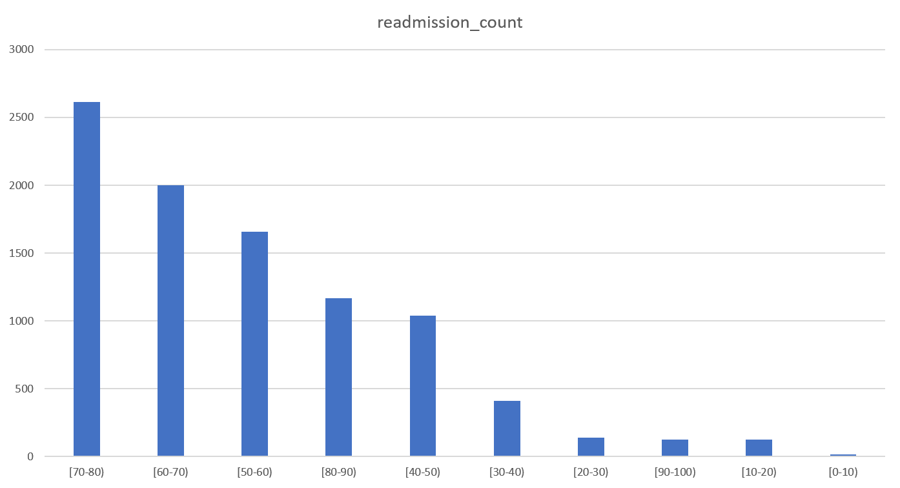
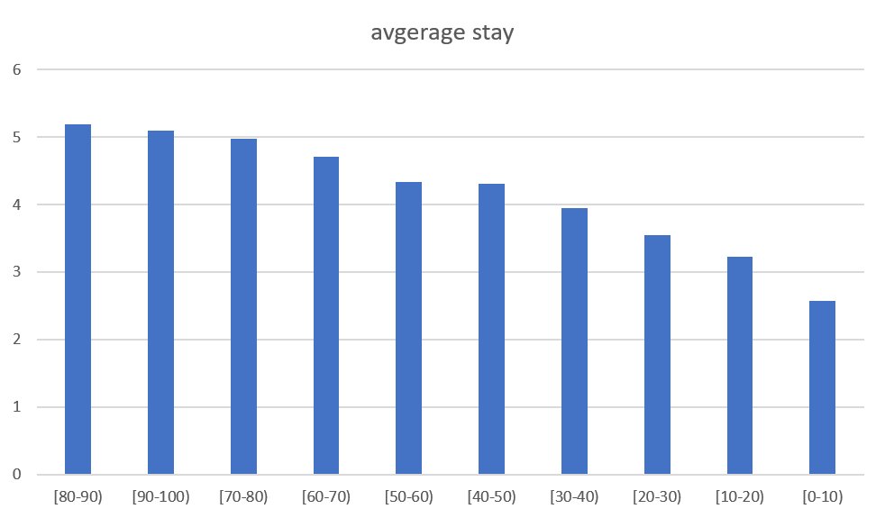
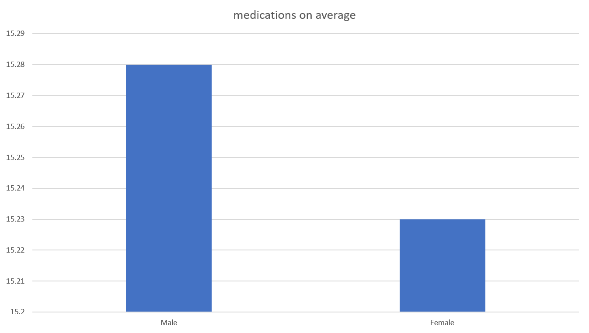
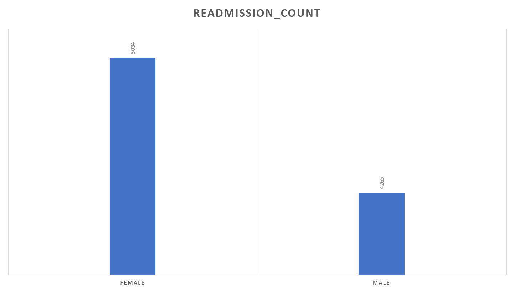
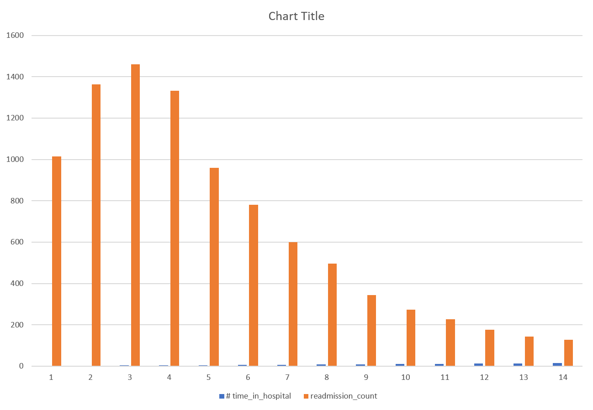

****Healthcare SQL Analytics Project – SK**********
**********
📌 Project Overview

This project analyzes a real-world healthcare dataset (Diabetes 130-US hospitals, stored as newhospitaldata) using SQL for querying and Excel for visualization.
The focus is on uncovering patterns in patient readmissions, demographics, and hospital stay durations.

✅ SQL queries for 5 business questions
✅ Visualizations created in Excel (saved as images)
✅ Insights for each analysis

**🔍 Business Questions & Insights**

**Q1. Which age group has the highest readmission rate?********

SELECT age, COUNT(*) AS readmission_count
FROM newhospitaldata
WHERE readmitted <> 'NO'
GROUP BY age
ORDER BY readmission_count DESC;

Chart

💡 Insights

Middle-aged (50–70) and elderly patients (>70) have the highest readmissions.

Younger patients (<30) rarely return to the hospital.

Hospitals could focus targeted follow-ups and discharge plans for 50+ age groups.

**Q2. What is the average hospital stay across age groups?********

SELECT age, AVG(time_in_hospital) AS avg_stay
FROM newhospitaldata
GROUP BY age
ORDER BY avg_stay DESC;

Chart

💡 Insights

Average hospital stay increases steadily with age.

Patients aged 70+ stay the longest (resource-heavy).

This highlights the need for specialized elderly care programs and bed management planning.

****Q3. Do male or female patients take more medications on average?********

SELECT gender, AVG(num_medications) AS avg_meds
FROM newhospitaldata
GROUP BY gender;

Chart

💡 Insights

Female patients take slightly more medications than male patients.

The difference is not huge, but consistent across the dataset.

A deeper age + gender breakdown could reveal prescription risk patterns.

**Q4. Which gender has higher readmission rates?**

SELECT gender, COUNT(*) AS readmission_count
FROM newhospitaldata
WHERE readmitted <> 'NO'
GROUP BY gender
ORDER BY readmission_count DESC;

Chart

💡 Insights

Female patients show slightly higher readmissions than males.

However, gender has a weaker effect compared to age.

Hospitals should prioritize age-focused readmission reduction plans rather than gender-based.

**Q5. Does longer hospital stay reduce readmission rates?**

SELECT time_in_hospital, COUNT(*) AS readmission_count
FROM newhospitaldata
WHERE readmitted <> 'NO'
GROUP BY time_in_hospital
ORDER BY time_in_hospital;

Chart

💡 Insights

Shorter stays (1–3 days) often lead to higher readmissions → possibly rushed discharges.

Moderate stays (5–7 days) show the lowest readmission risk.

Very long stays (10+ days) don’t guarantee fewer readmissions → often linked to serious chronic conditions.

📌 Project Summary

This project demonstrates how SQL + Excel can be combined to turn raw hospital records into actionable insights.

Key Findings:

👵 Age is the biggest predictor of readmissions.

⚖️ Gender has some effect, but weaker compared to age.

🏥 Discharge planning and stay duration are critical in lowering readmissions.

Skills Demonstrated:

SQL: data cleaning, grouping, aggregation.

Excel: charting, visual storytelling.

Business insights: linking technical results to healthcare impact.

📌 Project Summary

This project demonstrates how SQL + Excel can be combined to turn raw hospital records into actionable insights.

Key Findings:

👵 Age is the biggest predictor of readmissions.

⚖️ Gender has some effect, but weaker compared to age.

🏥 Discharge planning and stay duration are critical in lowering readmissions.

Skills Demonstrated:

SQL: data cleaning, grouping, aggregation.

Excel: charting, visual storytelling.

Business insights: linking technical results to healthcare impact.

**Created by SK**
